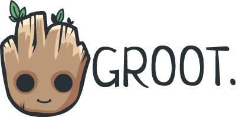
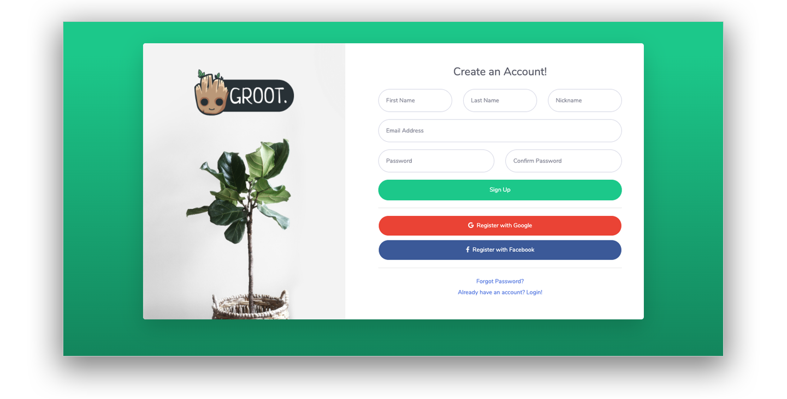
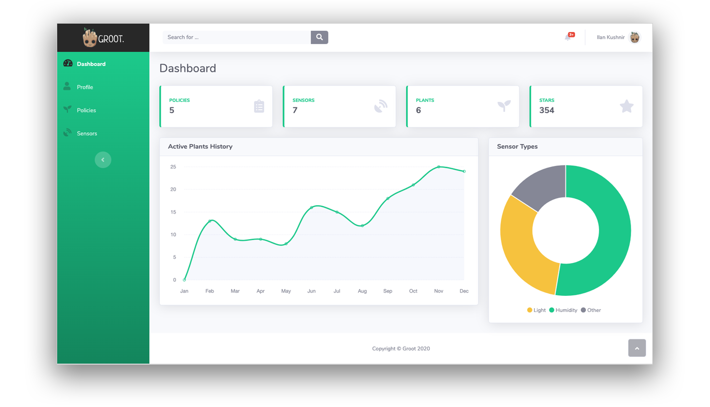
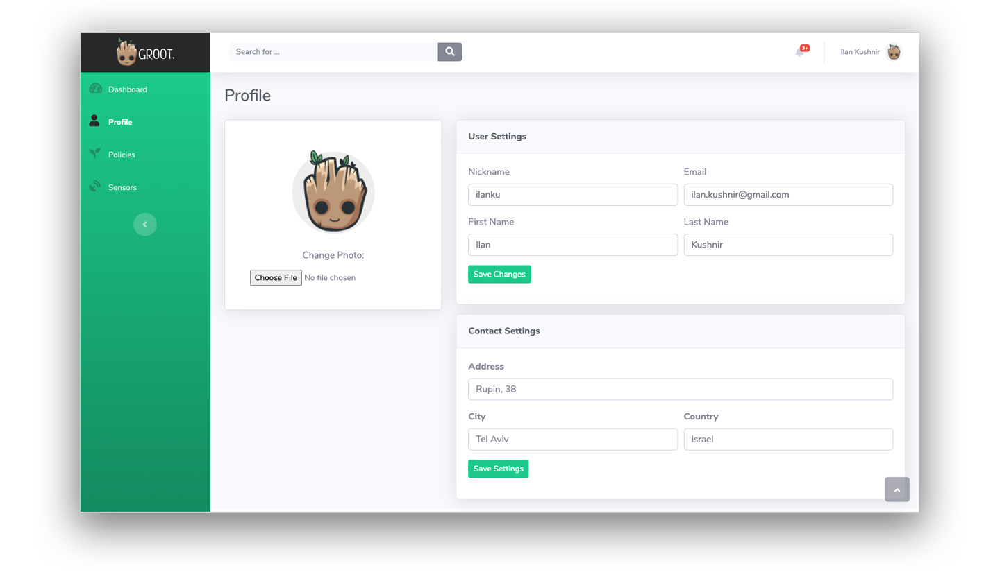
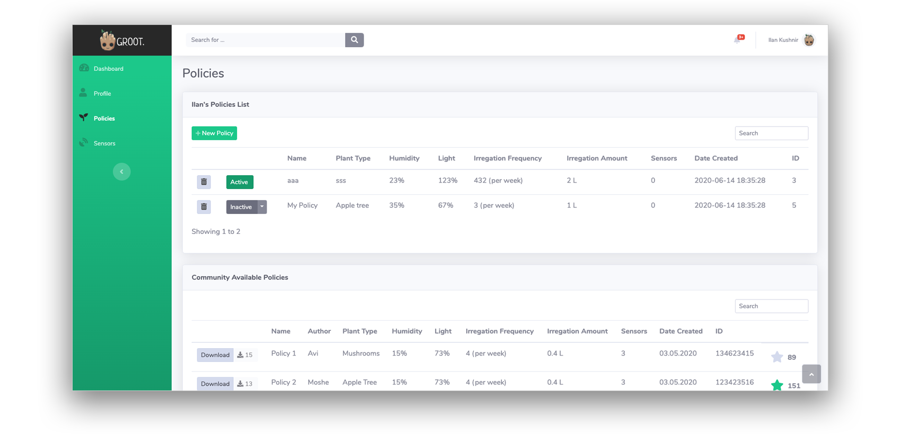

<div align="center">



</div>

# Project Groot 🌱

Project Groot is an open-source garden management system. In its core, Project Groot is a regular automatic plant growing system: it reads data from humidity and light sensors and decides when to give the plants more water, less water, more light or less light. What differentiates Project Groot from other garden management systems, is that it allows users to write their own growth plans for different plants. Users can then share their growth plans through the Groot network and users can also download and review plans from other users. Project Groot can also manage various plants with different sensors and growth plans at the same time.

## Screenshots






## Getting Started

These instructions will get you a copy of the project up and running on your local machine.

### Prerequisites

What things you need to install the software and how to install them:

  * Download and Install [Vagrant](https://www.vagrantup.com/) and [Virtual Box](https://www.virtualbox.org/) on your local computer
  * Clone/ Download the zip file from the Groot repository to your local computer

### Initializing Project Groot Virtual Environment

A step by step series that tell you how to get Project Groot up and running

1. Clone + Fork the repository
2. Open command prompt and navigate to the local directory where all the files are
3. Spin the environment using:
  ```vagrant
  vagrant up
  ```
4. Enter this URL - http://localhost:5000 to your web browser
5. When finished, tear down the environment using:
  ```vagrant
  vagrant destroy -f
  ```

## Built With

* [Flask](https://palletsprojects.com/p/flask/) - Lightweight WSGI web application framework
* [Python](https://www.python.org/) - Python is an interpreted, high-level, general-purpose programming language
* [Vagrant](https://www.vagrantup.com/) - Vagrant is a tool for building and managing virtual machine environments in a single workflow
* [Virtual-Box](https://www.virtualbox.org/) - VirtualBox is a powerful x86 and AMD64/Intel64 virtualization product for enterprise as well as home use
* [PostgreSQL](https://www.postgresql.org/) - PostgreSQL, also known as Postgres, is a free and open-source relational database management system emphasizing extensibility and SQL compliance
* [Bootstrap](https://getbootstrap.com/) - Bootstrap is a free and open-source CSS framework directed at responsive, mobile-first front-end web development. It contains CSS- and JavaScript-based design templates for typography, forms, buttons, navigation, and other interface components

## Contributing

Please see our [CONTRIBUTING.md](CONTRIBUTING.md) file for details on how to contribute to the Groot community.

## License

This project is licensed under the MIT License - see the [LICENSE.md](LICENSE.md) file for details


